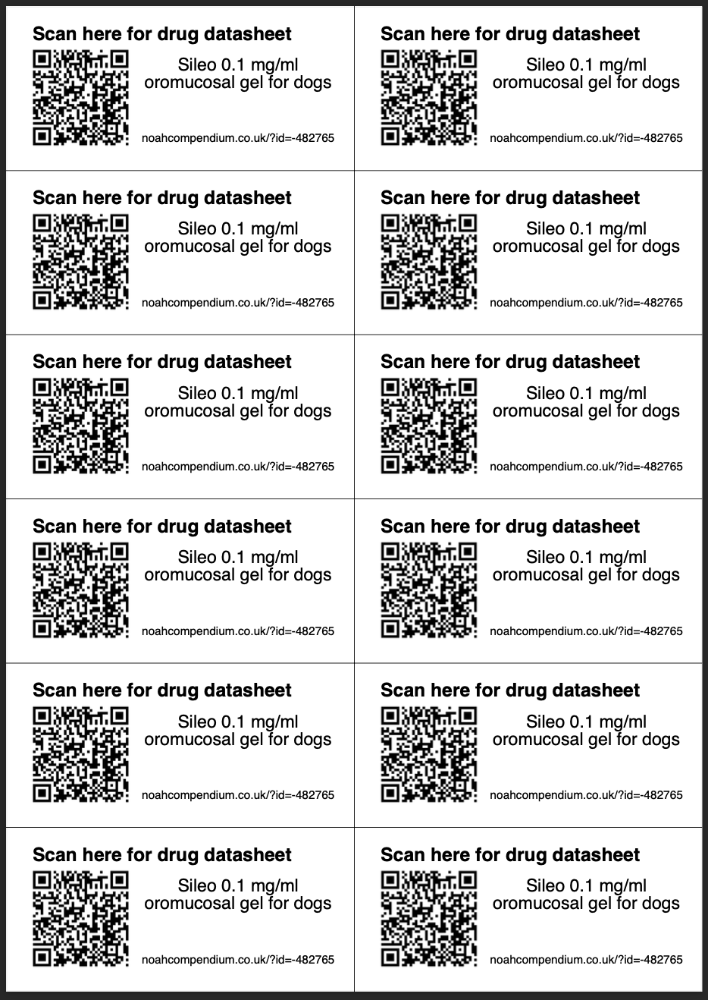

# Noah QR Code

#### Description:
Python program which takes a CSV file extracted from data from the Noah Compendium ["Drug Name", ID]. This then automatically creates for each veterinary drug a separate PDF label sheet containing a QR code which points to the Noah Compendium Datasheet for the specific drug, as well as a written link for users unable to use a QR code reader. Each PDF contains 12 labels. 

#### Project aims:
This program was developed as RCVS requires that all split pack medications are required to provide a package insert or a link to a Noah datasheet is given each time they are dispensed. This can be time consuming finding and printing/scanning a multipage datasheet as well as wasting lots of paper. 

### Examples:

https://github.com/MrVisneski/Noah-QR-Code/assets/38617758/893a2936-ffdd-4f90-b0da-559db378ba5e

### Example of QR codes being used in practice:

